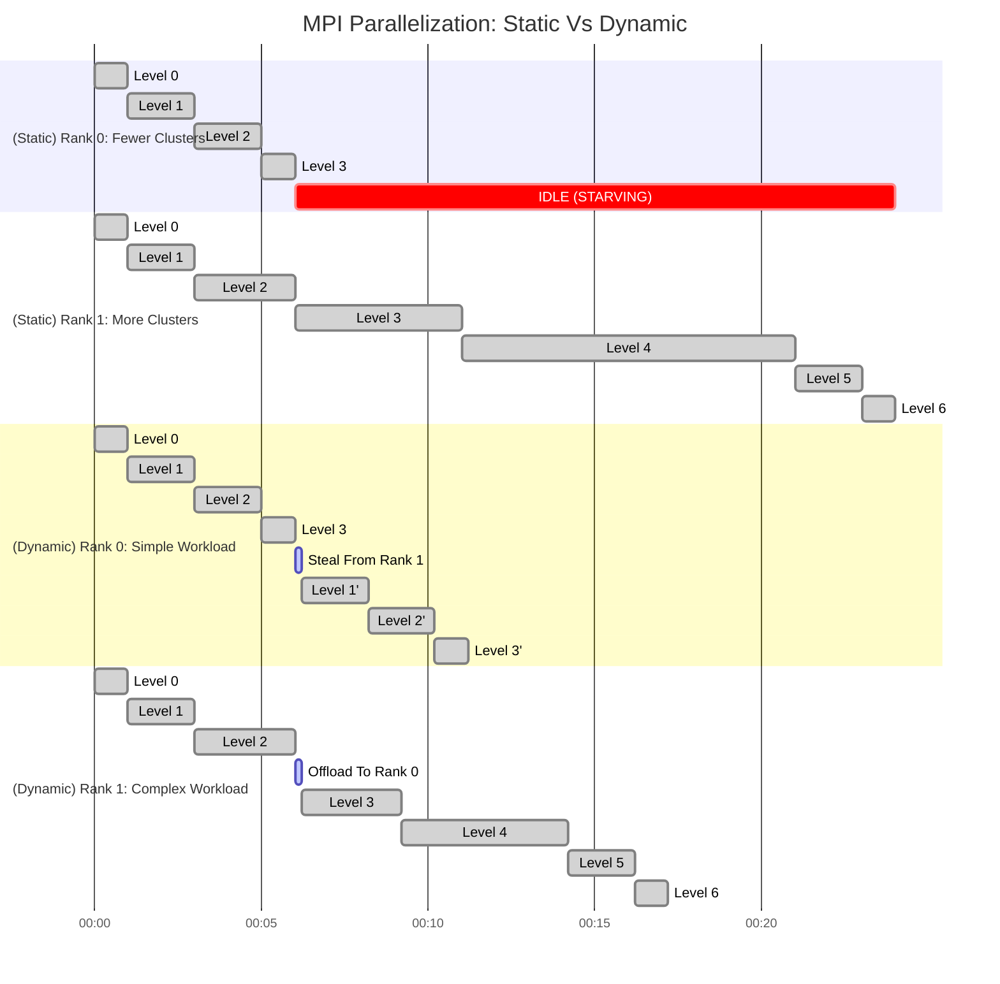

# `gpu_adaptive_clustering.py` Flowchart

```mermaid
flowchart TD

    %% ----- Styles -----
    classDef startEnd   fill:#4CAF50,stroke:#2E7D32,stroke-width:2px,color:#ffffff;
    classDef decision   fill:#FFF59D,stroke:#F9A825,stroke-width:1px,color:#F57F17;

    %% loop blocks = things happening inside explicit Python for-loops over clusters
    classDef loopBlock  fill:#FFE0B2,stroke:#EF6C00,stroke-width:1px,color:#E65100;

    %% batch blocks = level-wide / vectorized GPU work (CuPy kernels, big matops)
    classDef batchBlock fill:#C5CAE9,stroke:#283593,stroke-width:1px,color:#1A237E;

    %% neutral process
    classDef process    fill:#E0E0E0,stroke:#616161,stroke-width:1px,color:#212121;

    %% ----- Top-level adaptive_cluster_algorithm_gpu -----
    A["Start<br/>adaptive_cluster_algorithm_gpu"] --> C["Run initial GPU KMeans<br/>and get labels"]
    C --> D["refine_adaptive_clusters<br/>with X and labels"]

    %% Output after refinement
    R9 --> OUT["Final clusters<br/>(list[Cluster])"]

    %% ----- refine_adaptive_clusters subgraph -----
    subgraph REFINE["refine_adaptive_clusters <br/> (BFS over levels)"]
        direction TB

        R0["Build initial queue<br/>from KMeans labels"]:::process
        R0 --> R1["final_clusters = []<br/>level = 0"]:::process

        R1 --> R2{"Is queue empty?"}:::decision
        R2 -->|Yes| R9["Return<br/>final_clusters"]:::startEnd

        R2 -->|No| R3["- Take all clusters in<br/>current BFS level → level<br/> - Reset queue = []"]:::process

        %% ---------- Per-cluster pre-processing loop ----------
        subgraph LOOP_PRE["Per-cluster pre-processing<br/>(for cluster_pts in level)"]
            direction TB

            R3 --> R3A["Iterate over clusters<br/>cluster_pts ∈ level"]:::loopBlock

            R3A --> R3B{"cluster_size &lt;<br/>min_pts_per_cluster ?"}:::decision

            R3B -->|No| R3F["- Keep cluster as-is<br/>- Append cluster_pts →<br/>current_level_clusters<br/>- Record size"]:::loopBlock

            R3B -->|Yes| R3C{"should_generate_<br/>extra_points ?"}:::decision

            R3C -->|Yes| R3D["- Generate extra points via<br/>convex combinations<br/>work_X = <br/>concat(cluster_pts, new_X)<br/> -Append work_X → <br/> current_level_clusters<br/> - Record augmented size"]:::loopBlock

            R3C -->|No| R3E["Add cluster_pts →<br/>small_clusters_to_finalize<br/>(finalized separately)"]:::loopBlock
        end

        %% ---------- Loop finalizing small clusters directly ----------
        R3E --> R4A["For each cluster_pts in<br/>small_clusters_to_finalize:<br/>- Taylor error on that cluster<br/> - Append to final_clusters"]:::loopBlock

        %% if no clusters left for batching, skip
        R4A --> R4{"current_level_clusters <br/> empty?"}:::decision
        R3F --> R4
        R3D --> R4

        R4 -->|Yes| R9

        %% ---------- Level-wise batched computations ----------
        R4 -->|No| RB1["Concatenate current_level_<br/>_clusters<br/>→ all_X <br/> (points for this level)"]:::batchBlock

        RB1 --> RB3["Compute centroids:<br/>- Mean of each cluster<br/>(current_level_clusters)"]:::batchBlock

        RB3 --> RB4["Compute: <br/> - F_centroids = <br/> f(centroids)<br/>- J_centroids = <br/> grad_f(centroids)"]:::batchBlock

        RB4 --> RB5["Compute: F_true = f(all_X)"]:::batchBlock

        RB5 --> RB6["Broadcast centroids/J <br/> onto all_X <br/> Build F_taylor for all points<br/>err = ||F_true - F_taylor||"]:::batchBlock

        RB6 --> RB7["Compute thresholds thr = <br/> max(atol,<br/>rtol · ||F_true||) and <br/> violations_mask = (err &gt; thr)"]:::batchBlock

        RB7 --> RB8["ID violating clusters"]:::batchBlock

        RB8 --> RS0["Pre-compute <br/> cluster_error_stats[i]<br/>(max, mean err per cluster)"]:::loopBlock

        %% ---------- Per-cluster stats and per-cluster handling ----------
        subgraph LOOP_STATS_AND_SPLIT["Per-cluster stats"]
            direction TB


            RS0 --> RS1["Create CUDA streams list"]:::process

            RS1 --> RS2["for i, X_cluster in <br/> enumerate(level):<br/>pick stream = <br/> streams[i % num_streams]"]:::loopBlock

            RS2 --> RS3{"i ∈ violating_clusters ?"}:::decision

            %% non-violating path
            RS3 -->|No| RS4["Non-violating cluster:<br/>centroid = centroids[i]<br/>augmented_X = <br/> current_level_clusters[i]<br/>radius, hessian proxy &lt;--  <br/> from augmented_X and <br/> cluster_error_stats[i]<br/>append Cluster → <br/> final_clusters"]:::loopBlock

            %% violating path
            RS3 -->|Yes| RS5["Violating cluster:<br/>work_X = <br/> current_level_clusters[i]<br/>q = randomized_qr_<br/>_gpu(work_X)<br/>median_cut_projection(work_X, <br/> q)→ left/right children arrays"]:::loopBlock

            RS5 --> RS6["Append children_left/right lists<br/>for next BFS level"]:::loopBlock
        end

        RS4 --> RS7["Synchronize all CUDA streams"]:::batchBlock
        RS6 --> RS7

        RS7 --> RS8["queue = children_left ∪ children_right<br/>n_level++"]:::process
        RS8 --> R1
    end

    %% Wire top-level call into refine flow
    D --> R0

    %% Connect refine output to OUT
    R9 --> OUT

    %% ----- Class assignments -----
    class A,OUT startEnd;
    class B,C,D,R0,R1,R3,R4,R14,RB0,RB1,RB2,RB3,RB4,RB5,RB6,RB7,RB8,RS1,RS7,RS8 process;
    class R2,R3B,R3C,R4,RS3 decision;
    class R3A,R3D,R3E,R3F,RB3,R4A,RS0,RS2,RS4,RS5,RS6 loopBlock;
    class RB0,RB1,RB2,RB4,RB5,RB6,RB7,RB8 batchBlock;
```

# MPI Parallelization

```mermaid
gantt
    title MPI Parallelization: Static Vs Dynamic
    dateFormat  mm:ss
    axisFormat  %M:%S
    
    section (Static) Rank 0: Fewer Clusters
    Level 0             :done, s1, 00:00, 1s
    Level 1             :done, s2, after s1, 2s
    Level 2             :done, s3, after s2, 2s
    Level 3             :done, s4, after s3, 1s
    IDLE (STARVING)     :crit, s5, after s4, 18s
    
    section (Static) Rank 1: More Clusters
    Level 0             :done, s6, 00:00, 1s
    Level 1             :done, s7, after s6, 2s
    Level 2             :done, s8, after s7, 3s
    Level 3             :done, s9, after s8, 5s
    Level 4             :done, s10, after s9, 10s
    Level 5             :done, s11, after s10, 2s
    Level 6             :done, s12, after s11, 1s

    section (Dynamic) Rank 0: Simple Workload
    Level 0             :done, d1, 00:00, 1s
    Level 1             :done, d2, after d1, 2s
    Level 2             :done, d3, after d2, 2s
    Level 3             :done, d4, after d3, 1s
    Steal From Rank 1   :active, d5, after d4, 0.2s
    Level 1'   :done, d6, after d5, 2s
    Level 2'   :done, d7, after d6, 2s
    Level 3'   :done, d8, after d7, 1s

    section (Dynamic) Rank 1: Complex Workload
    Level 0             :done, d9, 00:00, 1s
    Level 1             :done, d10, after d9, 2s
    Level 2             :done, d11, after d10, 3s
    Offload To Rank 0   :active, d12, 00:06, 0.2s
    Level 3             :done, d13, after d12, 3s
    Level 4             :done, d14, after d13, 5s
    Level 5             :done, d15, after d14, 2s
    Level 6             :done, d16, after d15, 1s
```